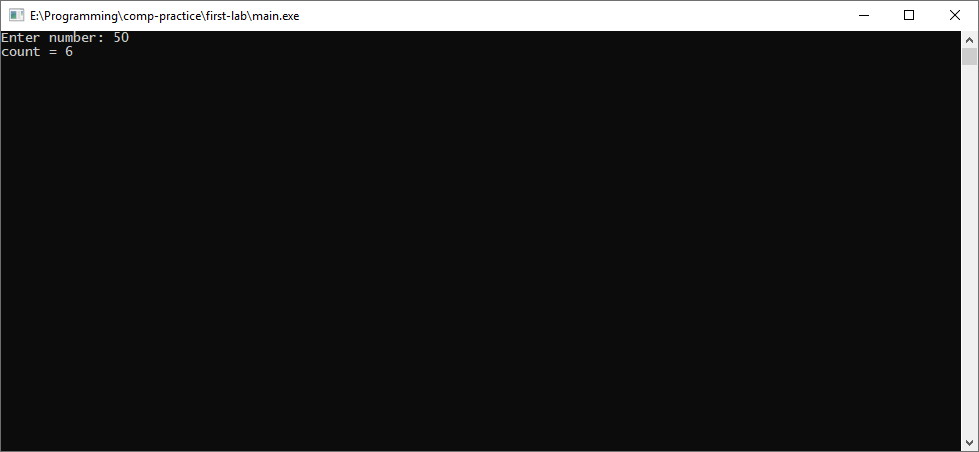
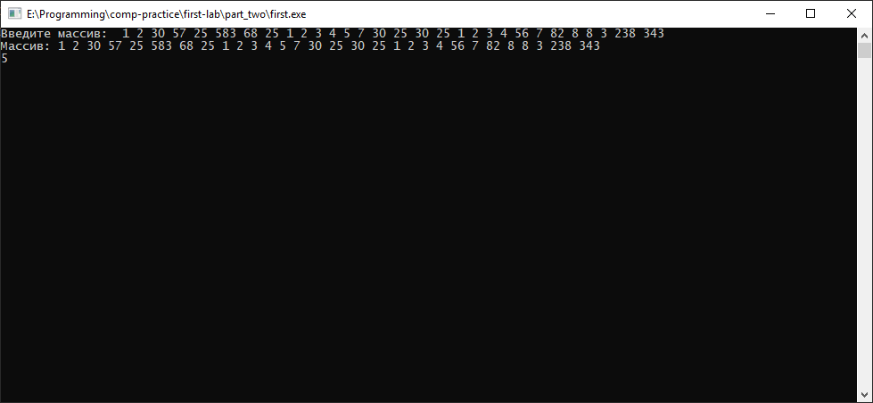

# Лабораторная работа №1 {#sec:chapter1}

## Цель работы

Изучить особенности работы с набором компиляторов и утилит GNU Compiler Collection (GCC)

## Задание

### Часть 1

1. Написать программу 1 в соответствии с вариантом при помощи любого текстового редактора;
2. Провести поэтапную компиляцию исходного текста написанной программы, разобраться в результатах, полученных на каждом этапе компиляции;
3. Провести оптимизацию кода написанной программы с помощью набора компиляторов GCC, пояснить внесённые для оптимизации кода изменения;

### Часть 2

4. Написать программы 2 и 3 в соответствии с вариантом при помощи любого текстового редактора. Функции для работы с массивом вынести в отдельные файлы: в одном файле описать функции для ввода/вывода массива, в другом --- для обработки массива. В обеих программах должны использоваться одни и те же функции для ввода/вывода массивов, описанные в одном из этих файлах;
5. Провести раздельную компиляцию написанных файлов;
6. Скомпилировать обе программы, используя созданные объектные файлы, обе программы должны использовать один и тот же объектный файл с функциями для ввода/вывода массива;
7. Создать статическую библиотеку для ввода/вывода массива и продемонстрировать возможности по её подключению;

### Вариативная часть (Вариант 15)

1. Исходное данное - натуральное число K, выражающее площадь.
Написать программу для нахождения всех таких прямоугольников, площадь которых равна K и стороны выражены натуральными числами;
2. Дан массив целых чисел В (30). Определить, сколько из них делится на 7 без остатка;

3. Вычислить Z = (Sп + Sо) / Sп - Sо, где Sп и Sо – суммы положительных и отрицательных элементов массива А (70);


## Результат выполненной работы

### Часть 1

Исходный код (**файл main.c**):
```c
#include <stdlib.h>
#include <stdio.h>
#include <math.h>

int main(int argc, char** argv)
{
	unsigned int K = 0;
	unsigned short i = 1;
	unsigned short count = 0;

	printf("Enter number: ");
	scanf("%u", &K);

	for (; i <= (unsigned short)sqrt(K); i++)
	{
		if (K % i == 0)
		{
			count++;
		}
	}

	count *= 2;

	printf("count = %u", count);

	scanf("%u", &K);
	return 0;
}
```


Была проведена поэтапная компиляция программы в следующей последовательности:

1. Предпроцессорная обработка, с помощью команды `gcc -E -o main.i main.c`, в результате которой был получен исходный код программы с содержимым заголовочных файлов;

Файл main.i:

```c


extern double __attribute__((__cdecl__)) fmax (double, double);
extern float __attribute__((__cdecl__)) fmaxf (float, float);
extern long double __attribute__((__cdecl__)) fmaxl (long double, long double);


extern double __attribute__((__cdecl__)) fmin (double, double);
extern float __attribute__((__cdecl__)) fminf (float, float);
extern long double __attribute__((__cdecl__)) fminl (long double, long double);


extern double __attribute__((__cdecl__)) fma (double, double, double);
extern float __attribute__((__cdecl__)) fmaf (float, float, float);
extern long double __attribute__((__cdecl__)) fmal (long double, long double, long double);
# 931 "c:\\mingw\\include\\math.h" 3

# 5 "main.c" 2


# 6 "main.c"

int main(int argc, char** argv)
{
 unsigned int K = 0;
 unsigned short i = 1;
 unsigned short count = 0;

 printf("Enter number: ");
 scanf("%u", &K);

 for (; i <= (unsigned short)sqrt(K); i++)
 {
  if (K % i == 0)
  {
   count++;
  }
 }

 count *= 2;

 printf("count = %u", count);

 scanf("%u", &K);
 return 0;
}

   ```
   
1. Компиляция в ассемблерный код с помощью команды `gcc -S -o main.i main.c`;
   
Файл main.i


```
	.file	"main.c"
	.text
	.def	___main;	.scl	2;	.type	32;	.endef
	.section .rdata,"dr"
LC0:
	.ascii "Enter number: \0"
LC1:
	.ascii "%u\0"
LC2:
	.ascii "count = %u\0"
	.text
	.globl	_main
	.def	_main;	.scl	2;	.type	32;	.endef
_main:
LFB17:
	.cfi_startproc
	pushl	%ebp
	.cfi_def_cfa_offset 8
	.cfi_offset 5, -8
	movl	%esp, %ebp
	.cfi_def_cfa_register 5
	andl	$-16, %esp
	subl	$64, %esp
	call	___main
	movl	$0, 56(%esp)
	movw	$1, 62(%esp)
	movw	$0, 60(%esp)
	movl	$LC0, (%esp)
	call	_printf
	leal	56(%esp), %eax
	movl	%eax, 4(%esp)
	movl	$LC1, (%esp)
	call	_scanf
	jmp	L2
```

2. Компиляция в объектный код с помощью команды `gcc -с -o main.i main.c`, в результате которой был получен готовый к исполнению машинный код, блоки данных, а также список определенных в файле функций и внешних переменных;
   
3. Сборка объектного кода в исполняемый файл с помощью команды `gcc -o main.exe main.o`

 В итоге была получена работающая программа выполняющая требования задания.

 Программа была протестирована, далее представлены снимки экрана с работающей программой.



Рисунок 1 --- Демонстрация работы программы для числа 50


Рисунок 2 --- Демонстрация работы программы для числа 465465


Было проведена оптимизация ассемблерного кода в процессе поэтапной компиляции. Для оптимизации используется флаг -Оx, где x --- 1, 2, 3, каждый флаг устанавливает свою оптимизацию,причем -О1 --- минимальная оптимизация, а -О3 --- максимальная. 

Сравнивая файлы с разной оптимизацией, выделяются следующие изменения:

Без оптимизации:

```
movl	$0, %esi 
movl	$1, %ebx
```


В файле c оптимизацией О2

```
movl	60(%esp), %ecx
	movl	$1, %ebx		jmp	L2
	.p2align 4,,10
L5:
	movl	60(%esp), %ecx
	movzwl	%bx, %esi
	xorl	%edx, %edx
	movl	%ecx, %eax
	divl	%esi
	cmpl	$1, %edx
	adcw	$0, %di
	addl	$1, %ebx
```

В файле c оптимизацией О3

```

	jmp	L2
	.p2align 4,,10
L5:
	movl	60(%esp), %ecx
	movzwl	%bx, %esi
	xorl	%edx, %edx
	movl	%ecx, %eax
	divl	%esi
	cmpl	$1, %edx
	adcw	$0, %di
	addl	$1, %ebx

```

### Часть 2

#### Программа 2

Исходный код (**файл main.c**):
```c
#include <stdlib.h>
#include <stdio.h>
#include <locale.h>

#include "array_proc.h"
#include "count_div_by_7.h"

int main(int agrc, char** argv)
{
	setlocale(LC_ALL, "Rus");

	int B[30];

	array_input(B, 30);
	array_print(B, 30);

	int count = count_div_by_7(B, 30);
	 
	printf("%d\n", count);

	scanf("%d", &count);
	return 0;
}
```

Исходный код (**файл array_proc.h**):
```c
#include "stdio.h"

void array_input(int* mas, unsigned int count);
void array_print(int* mas, unsigned int count);

```


Исходный код (**файл array_proc.c**):
```c
#include "array_proc.h"

void array_print(int* mas, unsigned int count)
{
	unsigned int i = 0;

	printf("Массив: ");

	for (; i < count; i++)
	{
		printf("%d ", mas[i]);
	}

	printf("\n");
}

void array_input(int* mas, unsigned int count)
{
	unsigned int i = 0;

	printf("Введите массив: ");

	for (; i < count; i++)
	{
		scanf("%d", &mas[i]);
	}
}

```


Исходный код (**файл count_div_by_7.h**):
```c
#include "stdio.h"

int count_div_by_7(int* mas, unsigned int count);
```


Исходный код (**файл count_div_by_7.c**):
```c
#include "count_div_by_7.h"

int count_div_by_7(int* mas, unsigned int count)
{
	unsigned int i = 0;
	unsigned int count_numbers = 0;

	for (; i < count; i++)
	{
		count_numbers += mas[i] % 7 == 0;
	}

	return count_numbers;
}
```

Была проведена раздельная компиляция каждого из файлов, с помощью команд описанных в 1 части. В итоге были получены 3 объектных файла: main.o, array_proc.o, count_div_by_7.o.

Данные объектные файлы были собраны в исполняемый файл, выполняющий требуемую задачу.

Программа была протестирована, далее представлены снимок экрана с работающей программой.



Рисунок 3 --- Демонстрация работы программы 


В рамках этого задания была создана статическая библиотека. Для создания библиотеки была использована команда `ar crs libarray_proc.a array_proc.o count_div_by_7.o`. Программа 2, была скомпилирована с использованием объектных файлов main.o, count_div_by_7.o и библиотекой, созданной ранее, с помощью команды `gcc -o main.exe main.o -L. -larray_proc`. В результате была получена программа, работающая как и программа рассмотренная ранее.
