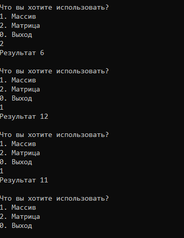

# Лабораторная работа №3 {#sec:chapter1}

## Цель работы

Изучить процесс создания динамических библиотек при помощи набора компиляторов иутилит GCC и особенности их применения.

## Задание


1. Написать программу в соответствие с вариантом.
2. Массив и матрицу заполнять случайными числами от -50 до 50.
3. Функции для работы с массивами и матрицами поместить в две отдельные динамические библиотеки.
4. При запуске программы пользователю должно быть представлено меню, в котором можно выбрать с чем будет происходить работа: с матрицей или с массивом.
5. В зависимости от выбора пользователя, загружается одна или другая динамическая библиотека.
6. Библиотеки должны быть скомпилированы с учётом возможного использования в ОС семейств Linux или Windows/
7. Основная программа должна при помощи директив препроцессора поддерживать мультиплатформенность в рамках этих двух семейств ОС.


### Вариативная часть (Вариант 14)

В массиве K (73) и матрице R (7х10) найти число элементов, которые делятся на 7 без остатка.

## Результат выполненной работы


Исходный код (**файл main.c**):
```c
#include <stdio.h>
#include <stdlib.h>

#ifdef __linux

#include <dlfcn.h>

#define LOAD_LIBRARY(lib_name, flags) dlopen(lib_name, flags)
#define LOAD_FUNCTION(lib, func_name) dlsym(lib, func_name)
#define CLOSE_LIBRARY(lib) dlclose(lib)


#elif defined _WIN32

#include <windows.h>

#define LOAD_LIBRARY(lib_name, flags) LoadLibrary(lib_name)
#define LOAD_FUNCTION(lib, func_name) GetProcAddress((HINSTANCE)lib, func_name)
#define CLOSE_LIBRARY(lib) FreeLibrary((HINSTANCE)lib);


#endif


#include "iostream"
using namespace std;


int main(int argc, char** argv)
{
	setlocale(LC_ALL, "Rus");

	
	int selected = 1;
	

	while (selected)
	{

	cout << "Что вы хотите использовать?" << endl;
	cout << "1. Массив" << endl;
	cout << "2. Матрица" << endl;
	cout << "0. Выход" << endl;


	cin >> selected;
	switch(selected)
	{

		case 1:
		{
			void* lib = LOAD_LIBRARY("array_proc.dll", NULL);
			if (!lib)
			{
				printf("Error open lib\n");
				break;
			}
			int (__stdcall *array_proc) (int*, int) = (__stdcall int (*)(int*, int))LOAD_FUNCTION(lib, "array_proc\0");
			

			int* mas = new int[73];

			for (int i = 0; i < 73; i++)
			{		
				mas[i] = rand() % 100 - 50;
			}
			int count_7 = array_proc(mas, 72);
			printf("Результат %d\n\n", count_7);

			delete[] mas;
			break;
		}

		case 2:
		{
			void* lib = LOAD_LIBRARY("matrix_proc.dll", NULL);
			if (!lib)
			{
				printf("Error open lib\n");
				break;
			}
			int (__stdcall *matrix_proc) (int**, int, int) = (__stdcall int (*)(int**, int, int))LOAD_FUNCTION(lib, "matrix_proc\0");


			int** matrix = new int*[7];
			for (int i = 0; i < 7; i++)
			{
				matrix[i] = new int[10];
			}

			for (int i = 0; i < 7; i++)
			{
				for (int j = 0; j < 10; j++)
				{
					matrix[i][j] = rand() % 100 - 50;
				}
			}
			int count_matrix_7 = matrix_proc(matrix, 7, 10);
			printf("Результат %d\n\n", count_matrix_7);
	
			break;
		}

	}

	}

	return 0;
}
```

Исходный код (**файл array_proc.h**):
```c
#pragma once

extern "C" __declspec(dllexport) int array_proc(int* mas, int count);
```

Исходный код (**файл array_proc.c**):
```c
#include "array_proc.h"

extern "C" __declspec(dllexport) int array_proc(int* mas, int count)
{
	int count_7 = 0;
	int i = 0;
	for (; i < count; i++)
	{
		if (mas[i] % 7 == 0)
		{
			count_7++;
		}
	}
	return count_7;
}
```

Исходный код (**файл matrix_proc.h**):
```c
#pragma once

extern "C" __declspec(dllexport) int matrix_proc(int** matrix, int i, int j);
```


Исходный код (**файл matrix_proc.c**):
```c
#include "matrix_proc.h"

extern "C" __declspec(dllexport) int matrix_proc(int* matrix[], int m, int n)
{
	int count_7 = 0;
	for (int i = 0; i < m; i++)
	{
		for (int j = 0; j < n; j++)
		{
			if (matrix[i][j] % 7 == 0)
			{
				count_7++;
			}
		}
	}
	return count_7;
}
```

На основе файлов с исходным кодом matrix_proc.c и array_proc.c были созданы объектные файлы с позиционно-независимым кодом с помощью команды `g++ -c -fPIC -o array_proc.o array_proc.cpp` и команды `g++ -c -fPIC -o matrix_proc.o matrix_proc.cpp`. 

На основе этих объектных файлов были созданы динамические библиотеки array_proc.dll и matrix_proc.dll с помощью команд `g++ -shared -o array_proc.dll array_proc.o` и `g++ -shared -o matrix_proc.dll matrix_proc.o` соотвественно. 

Для кроссплатформенности в файле main.cpp были добавлены дерективы препроцессора.
```cpp

#ifdef __linux

#include <dlfcn.h>

#define LOAD_LIBRARY(lib_name, flags) dlopen(lib_name, flags)
#define LOAD_FUNCTION(lib, func_name) dlsym(lib, func_name)
#define CLOSE_LIBRARY(lib) dlclose(lib)


#elif defined _WIN32

#include <windows.h>

#define LOAD_LIBRARY(lib_name, flags) LoadLibrary(lib_name)
#define LOAD_FUNCTION(lib, func_name) GetProcAddress((HINSTANCE)lib, func_name)
#define CLOSE_LIBRARY(lib) FreeLibrary((HINSTANCE)lib);


#endif
```

Так же в файле main.cpp было добавлено меню для выбора нужной библиотеки.

По итогу выполнения лабораторной работы получилась работоспособная программа, выполняющая все требования задания.

Программа была протестирована, далее представлены снимок экрана с работающей программой.



Рисунок 3.1 --- Демонстрация работы программы
