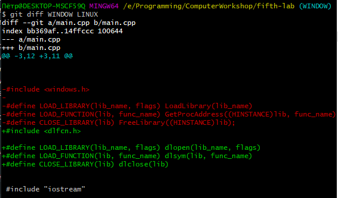
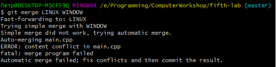
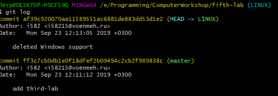
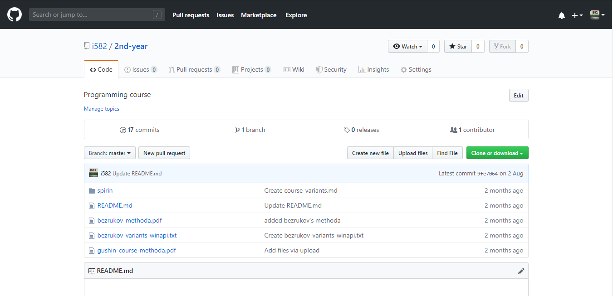
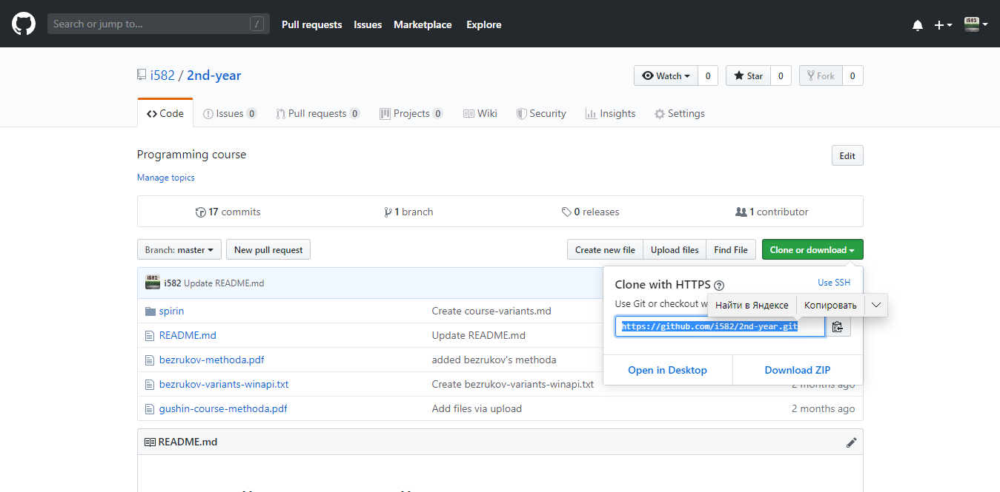

# Лабораторная работа №5 {#sec:chapter1}

## Цель работы

Изучить особенности различных систем контроля версий.

## Задание

### Часть 1. Работа с локальным репозиторием.

1. Используя систему контроля версий git, создать локальный
репозиторий для программы, написанной в третьей работе;
2. Используя команду commit, поместить текущее состояние
файлов с исходными текстами программы и библиотек в
созданный репозиторий.
3. Создать две ветви программы в репозитории - в одной убрать из
программы поддержку ОС семейства Windows, в другой - ОС
семейства Linux
4. Сравнить ветви и показать найденные конфликты.
5. Просмотреть историю изменений
6. Восстановить изначальную версию программы из репозитория

В отчете привести использованные команды и результаты их
исполнения.

### Часть 2. Работа с глобальным репозиторием.

1. Самостоятельно изучить различия основных систем контроля
версий --- CVS,SVN,Git.
2. Рассмотреть доступные глобальные репозитории для любой из
систем контроля версий
3. Описать процесс регистрации и работы с одним из
рассмотренных глобальных репозиториев.

В отчете привести сравнение систем контроля версий, обзор
различных глобальных репозиториев для одной из них и описание
процесса работы с одним из глобальных репозиториев.

## Результат выполненной работы

### Часть 1

Для создания локального репозитория Git была использована команда `git init` в папке с 3 лабораторной работой. Эта команда добавила изначальные файлы для пустого репозитория.

С помощью команды `git commit -m "added third-lab"` файлы лежащие в этом каталоге стали частью репозитория. Теперь добавление этих файлов является коммитом, т.е. снимком репозитория на данный момент. Именем этого снимка является строка после флага -m, что в нашем случае "added third-lab".

Для создания веток были использована команда `git checkout -b LINUX` и `git checkout -b WINDOW` для веток с поддержкой Linux и Window соответственно. Флаг -b в команде означает создание новой ветки.

Созданные ветки были сравнены с помощью команды `git diff LINUX WINDOW`. 

Рисунок 5.1 --- После выполнения команды `git diff LINUX WINDOW`

При выполнение команды `git merge LINUX WINDOW`, для слияний веток были выявлены следующие конфликты объединения.

Рисунок 5.2 --- Конфликты при объединении веток

Данные кофликты возникают из-за того, что в обоих ветках были изменен один и тот же файл main.cpp и при их объединении git не может их собрать в один единый файл.

Для просмотра истории изменения была использована команда `git log`

Рисунок 5.3 --- История изменения ветки LINUX

### Часть 2

Существует несколько разных глобальных репозиториев для системы git такие как:

1. "bitbucket.org"
2. "gitlab.com"
3. "cloud.google.com"
4. "github.com"

В данной работе был выбран именно github, так как у меня есть опыт работы с данной платформой. Gitlab в отличии от github имеет еще дополнительные инструменты, которые в данной работе не нужны. В отличии от bitbucket.org github сконцентрирован только на git. Cloud.google.com имеет ограничение в 500мб. 

Принимая во внимание все выше был рассмотрен глобальный репозитория git --- github. 

Рисунок 5.4 --- Страница регистрации

Рисунок 5.5 --- Страница репозитория

Для копирования глобального репозитория необходимо скопировать его адрес.

Рисунок 5.6 --- Копирование адреса

Для работы с git используется программа Bash для window. Для копирования репозитория необходимо открыть bash в папке в которую вы хотите поместить репозиторий и выполнить команду `git clone <путь к репозиторию>`.

В результате в папке появится папка с репозиторием git.
