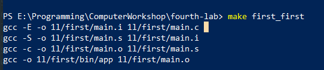
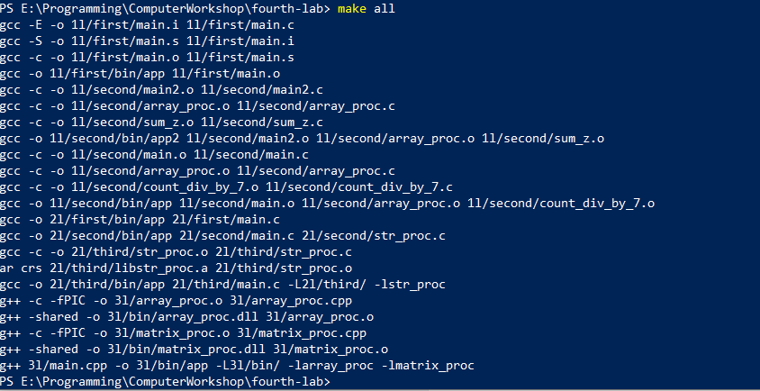

# Лабораторная работа №4 {#sec:chapter1}

## Цель работы

Изучить особенности работы с программой управления компиляцией на примере утилиты make.

## Задание

Написать makefile для всех программ, написанных в предыдущих лабораторных с
возможностью выбора требуемой лабораторной в зависимости от введённой цели. Учесть, что
файлы с исходным текстом программы будут лежать в подкаталогах, в которые также должны
будут помещены полученные объектные и исполняемые файлы.

## Результат выполненной работы

Для решения поставленной задачи было спроектировано следуюшее дерево папок

```c
    — 1l
        — first
            — bin
        — second
            — bin
    — 2l
        — first
            — bin
        — second
            — bin
        — third
            — bin
    — 3l
        — bin
    — makefile
```

В качестве фиктивных целей были выбраны следующие:

```makefile
.PHONY: first_first first_second_sum_z first_second_by_sev # для первой
.PHONY: second_first second_second second_third # для второй
.PHONY: third_first # для третий
.PHONY: all #для всех
```

Так же изначально были введены следующие переменные:
```makefile
CPP=g++
C=gcc

APP=app

PATH_FIRST=1l/
PATH_SECOND=2l/
PATH_THIRD=3l/

BIN_PATH=bin/
```

В результате был получен готовый makefile для компиляции любой из программ из первых 3 лабораторных работ.

```makefile

#general makefile for all labs

CPP=g++
C=gcc

APP=app


PATH_FIRST=1l/
PATH_SECOND=2l/
PATH_THIRD=3l/

BIN_PATH=bin/

.PHONY: first_first first_second_sum_z first_second_by_sev
.PHONY: second_first second_second second_third
.PHONY: third_first
.PHONY: all

###########################################################
# compile all labs                                        #
###########################################################
all: first_first first_second_sum_z first_second_by_sev second_first second_second second_third third_first
###########################################################


###########################################################
# compile first part of first lab                         #
###########################################################
first_first: main.o
	${C} -o ${PATH_FIRST}first/${BIN_PATH}${APP} ${PATH_FIRST}first/main.o

main.o: main.s
	${C} -c -o ${PATH_FIRST}first/main.o ${PATH_FIRST}first/main.s

main.s: main.i
	${C} -S -o ${PATH_FIRST}first/main.s ${PATH_FIRST}first/main.i

main.i:
	${C} -E -o ${PATH_FIRST}first/main.i ${PATH_FIRST}first/main.c
###########################################################


###########################################################
# compile second part of first lab program count_div_by_7 #
###########################################################
first_second_by_sev: fsbs_main.o fsbs_array_proc.o fsbs_count_div_by_7.o
	${C} -o ${PATH_FIRST}second/${BIN_PATH}${APP} ${PATH_FIRST}second/main.o ${PATH_FIRST}second/array_proc.o ${PATH_FIRST}second/count_div_by_7.o

fsbs_main.o:
	$(C) -c -o ${PATH_FIRST}second/main.o ${PATH_FIRST}second/main.c

fsbs_array_proc.o:
	$(C) -c -o ${PATH_FIRST}second/array_proc.o ${PATH_FIRST}second/array_proc.c

fsbs_count_div_by_7.o:
	$(C) -c -o ${PATH_FIRST}second/count_div_by_7.o ${PATH_FIRST}second/count_div_by_7.c
###########################################################


###########################################################
# compile second part of first lab program sum_z          #
###########################################################
first_second_sum_z: sz_main.o sz_array_proc.o sz_sum_z.o
	${C} -o ${PATH_FIRST}second/${BIN_PATH}${APP}2 ${PATH_FIRST}second/main2.o ${PATH_FIRST}second/array_proc.o ${PATH_FIRST}second/sum_z.o

sz_main.o:
	$(C) -c -o ${PATH_FIRST}second/main2.o ${PATH_FIRST}second/main2.c

sz_array_proc.o:
	$(C) -c -o ${PATH_FIRST}second/array_proc.o ${PATH_FIRST}second/array_proc.c

sz_sum_z.o:
	$(C) -c -o ${PATH_FIRST}second/sum_z.o ${PATH_FIRST}second/sum_z.c
###########################################################


###########################################################
# compile first part of second lab                        #
###########################################################
second_first:
	${C} -o ${PATH_SECOND}first/${BIN_PATH}${APP} ${PATH_SECOND}first/main.c
###########################################################


###########################################################
# compile second part of second lab                       #
###########################################################
second_second:
	${C} -o ${PATH_SECOND}second/${BIN_PATH}${APP} ${PATH_SECOND}second/main.c ${PATH_SECOND}second/str_proc.c
###########################################################


###########################################################
# compile third part of second lab                        #
###########################################################
second_third: libstr_proc.a
	${C} -o ${PATH_SECOND}third/${BIN_PATH}${APP} ${PATH_SECOND}third/main.c -L${PATH_SECOND}third/ -lstr_proc

libstr_proc.a: str_proc.o
	ar crs ${PATH_SECOND}third/libstr_proc.a ${PATH_SECOND}third/str_proc.o

str_proc.o:
	${C} -c -o ${PATH_SECOND}third/str_proc.o ${PATH_SECOND}third/str_proc.c
###########################################################


###########################################################
# compile first part of third lab                         #
###########################################################
third_first: larray_proc lmatrix_proc
	${CPP} ${PATH_THIRD}main.cpp -o ${PATH_THIRD}${BIN_PATH}${APP} -L${PATH_THIRD}${BIN_PATH} -larray_proc -lmatrix_proc

larray_proc: array_proc.o
	${CPP} -shared -o ${PATH_THIRD}${BIN_PATH}array_proc.dll ${PATH_THIRD}array_proc.o

lmatrix_proc: matrix_proc.o
	${CPP} -shared -o ${PATH_THIRD}${BIN_PATH}matrix_proc.dll ${PATH_THIRD}matrix_proc.o

array_proc.o:
	${CPP} -c -fPIC -o ${PATH_THIRD}array_proc.o ${PATH_THIRD}array_proc.cpp

matrix_proc.o:
	${CPP} -c -fPIC -o ${PATH_THIRD}matrix_proc.o ${PATH_THIRD}matrix_proc.cpp
###########################################################


```



Рисунок 4.1 --- Демонстрация работы программы для цели first_first




Рисунок 4.2 --- Демонстрация работы программы для цели all