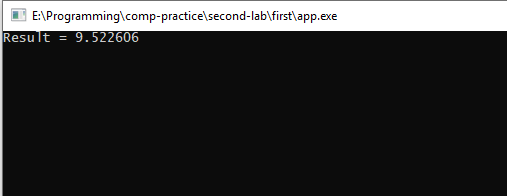
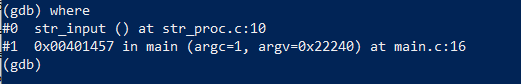
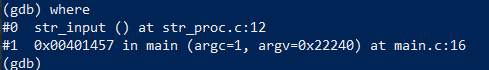
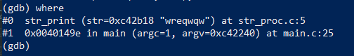
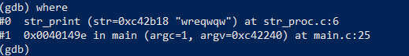
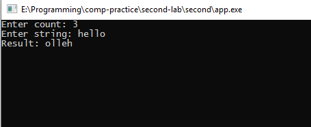

# Лабораторная работа №2 {#sec:chapter1}

## Цель работы

Ознакомиться с особенностями использования отладчика GDB.

## Задание

### Часть 1

1. Написать программу №1 в соответствии с вариантом при помощи любого текстового редактора.
2. Скомпилировать программу с добавлением в файл отладочной информации.
3. Используя отладчик GDB, проверить значение вычисляемого в цикле выражения на каждом шаге цикла. При использовании нескольких циклов, проверять все значения.
4. В отчёте привести используемые команды отладчика и полученный результат

### Часть 2

1. Написать программу №2 в соответствии с вариантом при помощи любого текстового редактора.
2. Для ввода и вывода строки использовать отдельные функции.
3. Скомпилировать программу с добавлением в файл отладочной информации.
4. Используя отладчик GDB, проверить содержимое стека при входе в функции ввода и вывода строки и выходе из них.
5. В отчёте привести содержимое стека и используемые команды.

### Часть 2

1. Написать программу №3 в соответствии с вариантом при помощи любого текстового редактора.
2. Для ввода и вывода строки использовать отдельные функции, помещённые в статическую библиотеку.
3. Скомпилировать программу с добавлением в файл отладочной информации.
4. Используя отладчик GDB, проверить содержимое стека при входе в функции ввода и вывода строки и выходе из них.
5. В отчёте привести содержимое стека и используемые команды.

### Вариативная часть (Вариант 14)

1. Составить программу для вычисления значения Y = sin(1) + sin(1.1) + ... + sin(2).
2. Дана строка символов. Поменять местами N первых и N последних символов заданной строки.
3. Дана строка, состоящая из букв и цифр. Проверить, является ли данная строка представлением числа в шестнадцатеричной системе счисления.


## Результат выполненной работы

### Часть 1

Исходный код (**файл main.c**):
```c
#include "stdio.h"
#include "stdlib.h"
#include "math.h"

int main(int argc, char** argv)
{
	double Y = 0.0;
	double i = 1.0;

	for ( ; i <= 2; i += 0.1)
	{
		Y += sin(i);
	}

	printf("Result = %lf", Y);

	scanf("%lf", &Y);
	return 0;
}
```


Была проведена компиляция программы c добавлением отладочной информации отладчика GDB с помощью команды `gcc -g -o app main.c`:

В итоге была получена работающая программа выполняющая требования задания.

Используя отладчик GDB, были просмотренны все значения переменной Y в цикле (строки 10-13) с помощью следующих команд:

1. Команда `gdb app.exe`, для запуска отладчика GDB;
2. Команда `break 12`, устанавливающая точку останова на строку 12;
3. Команда `run`, запускающая программу вплоть до первой точки останова;
4. Команда `print Y`, показывающая текущее значение переменной Y;

При заходе в цикл, значение Y равно 0. При следующей итерации цикла Y = 0.8414709848078965. В последующих итерациях значение Y увеличивалось. В результате программа вывела 9.522606. По итогам отладки ошибок не возникло.

Программа была протестирована, далее представлен снимки экрана с работающей программой.



Рисунок 2.1 --- Демонстрация работы программы


### Часть 2

#### Программа 2

Исходный код (**файл main.c**):
```c
#include "stdio.h"
#include "stdlib.h"
#include "string.h"
#include "str_proc.h"

int str_change(char* str, unsigned int count);

int main(int argc, char** argv)
{
	char* str;
	int N = 0;
	printf("Enter count: ");
	scanf("%d", &N);

	printf("Enter string: ");
	str = str_input();

	if (!str_change(str, N))
	{
		printf("Error: enter count > string length\n");
		return -1;
	}

	printf("Result: ");
	str_print(str);

	scanf("%d", &N);
	return 0;
}

int str_change(char* str, unsigned int count)
{
	unsigned int i = 0;
	char temp = 0;
	unsigned int length = strlen(str);

	if (count >= length)
		return 0;

	for (; i < count; i++)
	{
		temp = str[i];
		str[i] = str[length - 1 - i];
		str[length - 1 - i] = temp;
	}

	return 1;
}

```

Исходный код (**файл str_proc.h**):
```c
#pragma once

#include "stdio.h"
#include "stdlib.h"

void str_print(char* str);
char* str_input();
```


Исходный код (**файл str_proc.c**):
```c
#include "str_proc.h"

void str_print(char* str)
{
	printf("%s", str);
}

char* str_input()
{
	char* str = (char*)malloc(sizeof(char) * 100);
	scanf("%s", str);
	return str;
}
```
Была проведена компиляция программы c добавлением отладочной информации отладчика GDB с помощью команды `gcc -g -o app main.c`:

В итоге была получена работающая программа выполняющая требования задания.

Используя отладчик GDB, было проверено содержимое стека при входе в функции ввода и вывода строки и выходе из них.

При входе в функцию ввода, с помощью команды `where` был получен следующий результат:



Рисунок 2.2 --- Содержимое стека при входе в функцию ввода

При выходе из функции ввода:



Рисунок 2.3 --- Содержимое стека при входе в функцию ввода


При входе в функцию вывода:



Рисунок 2.4 --- Содержимое стека при входе в функцию вывода

При выходе из функции вывода:



Рисунок 2.5 --- Содержимое стека при входе в функцию вывода

Программа была протестирована, далее представлен снимок экрана с работающей программой.



Рисунок 2.6 --- Демонстрация работы программы


### Часть 3

Исходный код (**файл main.c**):
```c
#include "stdio.h"
#include "stdlib.h"
#include "string.h"
#include "str_proc.h"

int is_hex(char* str, int length);

int main(int argc, char** argv)
{
	char* str;
	int N = 0;

	printf("Enter string: ");
	str = str_input();

	if (!is_hex(str, strlen(str)))
	{
		printf("%s is not hex string\n", str);
	}
	else
	{
		printf("%s is hex string\n", str);
	}

	scanf("%d", &N);
	return 0;
}

int is_hex(char* str, int length)
{
	unsigned int i = 0;

	for (; i < length; i++)
		if (!(
			(str[i] >= 'A' && str[i] <= 'F')
			||
			(str[i] >= 'a' && str[i] <= 'f')
			||
			(str[i] >= '0' && str[i] <= '9')))
			return 0;

	return 1;
}
```

Была создана статическая библиотека ввода и вывода строки с помощью команды `ar crs libstr_proc.a str_proc.o`;

Была проведена компиляция программы c добавлением отладочной информации отладчика GDB с помощью команды `gcc -g -o app main.c`:

В итоге была получена работающая программа выполняющая требования задания.


Используя отладчик GDB, было проверено содержимое стека при входе в функции ввода и вывода строки и выходе из них.

При входе в функцию ввода, с помощью команды `where` был получен следующий результат:


Рисунок 2.7 --- Содержимое стека при входе в функцию ввода

При выходе из функции ввода:


Рисунок 2.8 --- Содержимое стека при входе в функцию ввода


При входе в функцию вывода:


Рисунок 2.9 --- Содержимое стека при входе в функцию вывода

При выходе из функции вывода:


Рисунок 2.10 --- Содержимое стека при входе в функцию вывода

Программа была протестирована, далее представлен снимок экрана с работающей программой.


Рисунок 2.11 --- Демонстрация работы программы
